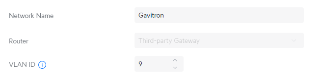
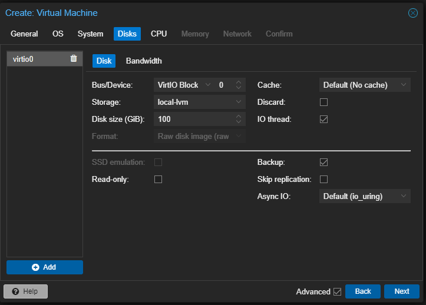
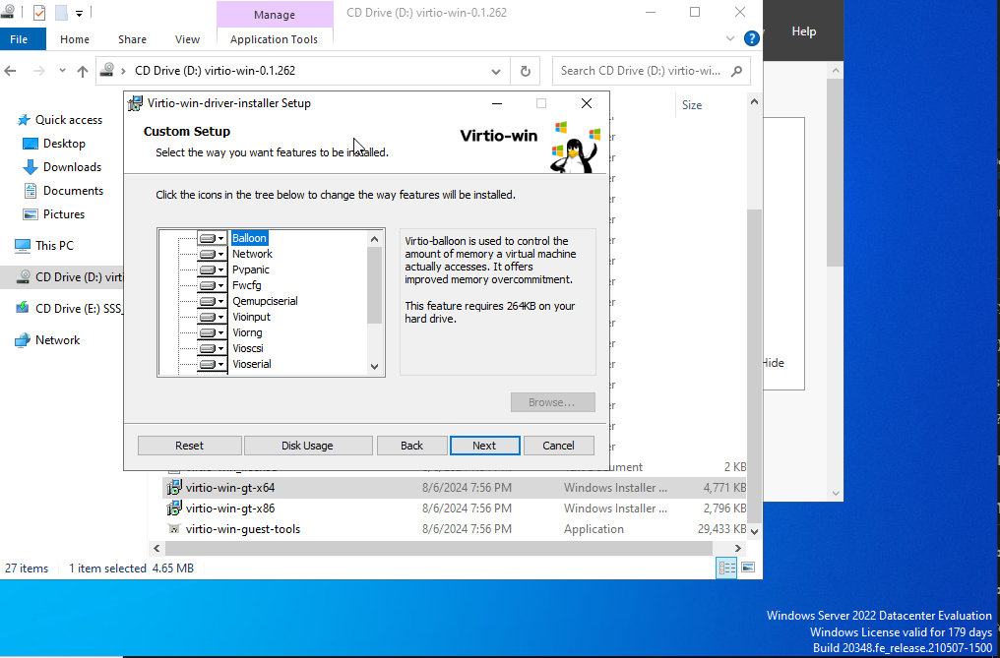
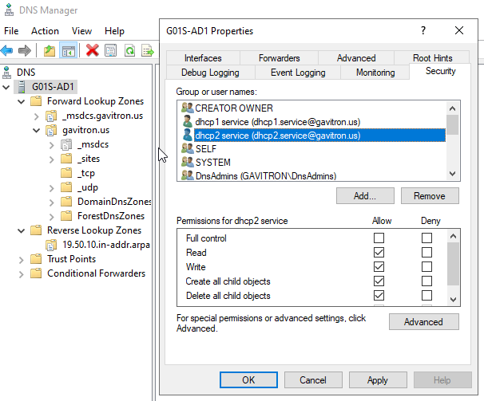

# Test Lab Creation

 
 
 

## Create VLAN 9

 Steps for VLAN Creation 

1. 

2.

Since I may later set up a VPC for site to site routing I picked something that falls in the 10.0.0.0/8 range of private ipv4 addresses. I picked 10.50.0.0/16 to give to the lab's "corporate" network. This gives us an IP range of 10.50.0.1 - 10.50.255.254

My format will be 10.50.[SITEID][VLAN].[DEVICEIP] and we could reserve the top end of the range for any simple single /24 vlan sites. This would give us the possibility of having 20+ sites with ten total /24 vlans each.

| Site | Site ID| Usable IP Range |
|----------|----------|----------|
| Cloud| 0 | 10.50.0.1-10.50.9.254|
| Lab 1| 1 | 10.50.10.1-10.50.19.254|
| Lab 2| 2 | 10.50.20.1-10.50.29.254|

I wanted to pick something unique and not too broad to avoid routing conflict with VPN Users from their home ISP router / hotel / business that may be giving clients a 10.0.0.0/8 private ipv4 address. 

Since I'm already using VLAN 1 on this router, I'll start the lab using VLAN 9 (10.50.19.0/24) for the Server VLAN. I would normally have a VLAN for vmhost / physical management as well but I'm using this vmhost for other personal projects.

 
 
 

## Create DHCP Server for VLAN 9

Steps to create DHCP Server

I will later replace this with Windows DHCP Role.

 
 
 

## Allow VLAN 9 traffic on Unifi Switch to EdgeRouter

 Steps to allow VLAN 9 traffic on Unifi Switch 

I also added vlan 9 tagged traffic to the allow list on the switchport profiel assigned to the servers switch ports.
 
 
 

## Upload Microsoft Windows Server 2022 Eval to ProxMox vmhost

 
 
 

## Create the Virtual Machine

 Steps to create virtual machine in proxmox 

Server 2022 is installed. If you use VirtIO SCSI controller (best performance) the windows installer will not initially see your virtual hard disk.

You need to download and upload the virtio-win.iso to proxmox, shutdown the VM and add a second virtual cd drive and mount the virtio-win.iso. Boot up the VM and load drivers during custom install. The INFs are located in the amd64\2k22

https://pve.proxmox.com/wiki/Windows_VirtIO_Drivers

https://fedorapeople.org/groups/virt/virtio-win/direct-downloads/stable-virtio/virtio-win.iso

I'll also install the whole virtIO suite after windows is updated and turn this into a clone and create full clones for any windows server I need.

 
 
 

## Setting up Primary Domain Controller

Steps to create primary domain controller

Save that DSRM password somewhere special!

 
 
 

## Setting up DHCP and DNS

Steps to create set up DHCP and DNS

 
Create all the DHCP Scopes, setting router to [scope range].1 and dns to domain controller 10.50.19.10

Disable DHCP server for VLAN 9 on EdgeMax Router

In order for DHCP to properly dynamically update DNS We need to Authorize the server and configure credentials.

First Authorize

Create Service Accounts (I can use dhcp2.service for a fail-over server later)

Create Service Account permissions to DNS Server

Create Forwarders for DNS lookups beyond the domain controller (I am experimenting with malware and content blocking cloudflare dns servers)

On the DHCP Server right click IPv4 and choose properties, on the advanced tab there is an option for DNS update credentials, add the service accounts

Now when we requset a new IP on the second Windows server, we will see DHCP is working and adding records to DNS Forward and Reverse Zones

New IP Acquired

DHCP server is showing the lease

DNS Server is showing the A Record

DNS Server is showing the PTR record

 
 
 
