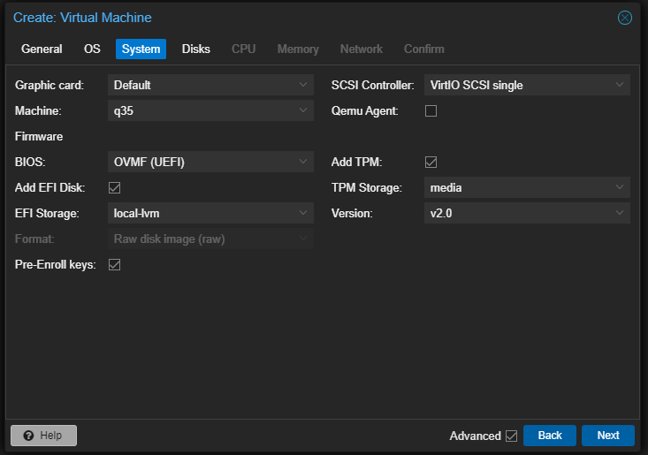

# Test Lab Creation

## Create VLAN 9
1. 


2.


Since I may later set up a VPC for site to site routing I picked something that falls in the 10.0.0.0/8 range of private ipv4 addresses. I picked 10.50.0.0/16 to give to the lab's "corporate" network. This gives us an IP range of 10.50.0.1 - 10.50.255.254

My format will be 10.50.[SITEID][VLAN].[DEVICEIP] and we could reserve the top end of the range for any simple single /24 vlan sites. This would give us the possibility of having 20+ sites with ten total /24 vlans each.


| Site | Site ID| Usable IP Range |
|----------|----------|----------|
| Cloud| 0 | 10.50.0.1-10.50.9.254|
| Lab 1| 1 | 10.50.10.1-10.50.19.254|
| Lab 2| 2 | 10.50.20.1-10.50.29.254|


I wanted to pick something unique and not too broad to avoid routing conflict with VPN Users from their home ISP router / hotel / business that may be giving clients a 10.0.0.0/8 private ipv4 address. 

Since I'm already using VLAN 1 on this router, I'll start the lab using VLAN 9 (10.50.19.0/24) for the Server VLAN. I would normally have a VLAN for vmhost / physical management as well but I'm using this vmhost for other personal projects.


<br>
<br>
<br>

## Create DHCP Server for VLAN 9


I will later replace this with Windows DHCP Role.
<br>
<br>
<br>

## Allow VLAN 9 traffic on Unifi Switch to EdgeRouter


I also added vlan 9 tagged traffic to the allow list on the switchport profiel assigned to the servers switch ports.
<br>
<br>
<br>

## Upload Microsoft Windows Server 2022 Eval to ProxMox vmhost

<br>
<br>
<br>

## Create the Virtual Machine





Server 2022 is installed. If you use VirtIO SCSI controller (best performance) the windows installer will not initially see your virtual hard disk.

You need to download and upload the virtio-win.iso to proxmox, shutdown the VM and add a second virtual cd drive and mount the virtio-win.iso. Boot up the VM and load drivers during custom install. The INFs are located in the amd64\2k22

https://pve.proxmox.com/wiki/Windows_VirtIO_Drivers

https://fedorapeople.org/groups/virt/virtio-win/direct-downloads/stable-virtio/virtio-win.iso


I'll also install the whole virtIO suite after windows is updated and turn this into a clone and create full clones for any windows server I need.


<br>
<br>
<br>

## Setting up Primary Domain Controller


Save that DSRM password somewhere special!


Enable typographer option to see result.

(c) (C) (r) (R) (tm) (TM) (p) (P) +-

test.. test... test..... test?..... test!....

!!!!!! ???? ,,  -- ---

"Smartypants, double quotes" and 'single quotes'


## Emphasis

**This is bold text**

__This is bold text__

*This is italic text*

_This is italic text_

~~Strikethrough~~


## Blockquotes


> Blockquotes can also be nested...
>> ...by using additional greater-than signs right next to each other...
> > > ...or with spaces between arrows.


## Lists

Unordered

+ Create a list by starting a line with `+`, `-`, or `*`
+ Sub-lists are made by indenting 2 spaces:
  - Marker character change forces new list start:
    * Ac tristique libero volutpat at
    + Facilisis in pretium nisl aliquet
    - Nulla volutpat aliquam velit
+ Very easy!

Ordered

1. Lorem ipsum dolor sit amet
2. Consectetur adipiscing elit
3. Integer molestie lorem at massa


1. You can use sequential numbers...
1. ...or keep all the numbers as `1.`

Start numbering with offset:

57. foo
1. bar


## Code

Inline `code`

Indented code

    // Some comments
    line 1 of code
    line 2 of code
    line 3 of code


Block code "fences"

```
Sample text here...
```

Syntax highlighting

``` js
var foo = function (bar) {
  return bar++;
};

console.log(foo(5));
```

## Tables

| Option | Description |
| ------ | ----------- |
| data   | path to data files to supply the data that will be passed into templates. |
| engine | engine to be used for processing templates. Handlebars is the default. |
| ext    | extension to be used for dest files. |

Right aligned columns

| Option | Description |
| ------:| -----------:|
| data   | path to data files to supply the data that will be passed into templates. |
| engine | engine to be used for processing templates. Handlebars is the default. |
| ext    | extension to be used for dest files. |


## Links

[link text](http://dev.nodeca.com)

[link with title](http://nodeca.github.io/pica/demo/ "title text!")

Autoconverted link https://github.com/nodeca/pica (enable linkify to see)


## Images


Like links, Images also have a footnote style syntax

![Alt text][id]

With a reference later in the document defining the URL location:

[id]: https://octodex.github.com/images/dojocat.jpg  "The Dojocat"


## Plugins

The killer feature of `markdown-it` is very effective support of
[syntax plugins](https://www.npmjs.org/browse/keyword/markdown-it-plugin).


### [Emojies](https://github.com/markdown-it/markdown-it-emoji)

> Classic markup: :wink: :cry: :laughing: :yum:
>
> Shortcuts (emoticons): :-) :-( 8-) ;)

see [how to change output](https://github.com/markdown-it/markdown-it-emoji#change-output) with twemoji.


### [Subscript](https://github.com/markdown-it/markdown-it-sub) / [Superscript](https://github.com/markdown-it/markdown-it-sup)

- 19^th^
- H~2~O


### [\<ins>](https://github.com/markdown-it/markdown-it-ins)

++Inserted text++


### [\<mark>](https://github.com/markdown-it/markdown-it-mark)

==Marked text==


### [Footnotes](https://github.com/markdown-it/markdown-it-footnote)

Footnote 1 link[^first].

Footnote 2 link[^second].

Inline footnote^[Text of inline footnote] definition.

Duplicated footnote reference[^second].

[^first]: Footnote **can have markup**

    and multiple paragraphs.

[^second]: Footnote text.


### [Definition lists](https://github.com/markdown-it/markdown-it-deflist)

Term 1

:   Definition 1
with lazy continuation.

Term 2 with *inline markup*

:   Definition 2

        { some code, part of Definition 2 }

    Third paragraph of definition 2.

_Compact style:_

Term 1
  ~ Definition 1

Term 2
  ~ Definition 2a
  ~ Definition 2b


### [Abbreviations](https://github.com/markdown-it/markdown-it-abbr)

This is HTML abbreviation example.

It converts "HTML", but keep intact partial entries like "xxxHTMLyyy" and so on.

*[HTML]: Hyper Text Markup Language

### [Custom containers](https://github.com/markdown-it/markdown-it-container)

::: warning
*here be dragons*
:::
